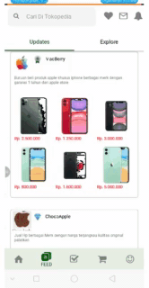

FAKE UI TOKPED

---

### Installing

See setup instructions  
1.npx react-native init TokopediaFake 
2.move folder src from TokopediaFake-master to  react native project  "TokopediaFake" 
3.copy all library  in package.json belong to current lib are install of TokodiaFake-master 
4.npm install or yarn 
5.move to your current project 
6.cd ios ,next please type pod install in terminal or cmd 

#### For React Native  0.61.4

## You can custome design with edit m=our code

### description of project
making imitation of tokopedia ui   from newbe 
### All UI are Fake from Tokped

    <tr>
    <td> Home Screen   </td>
    <td> Feed Screen   </td>
    </tr>

